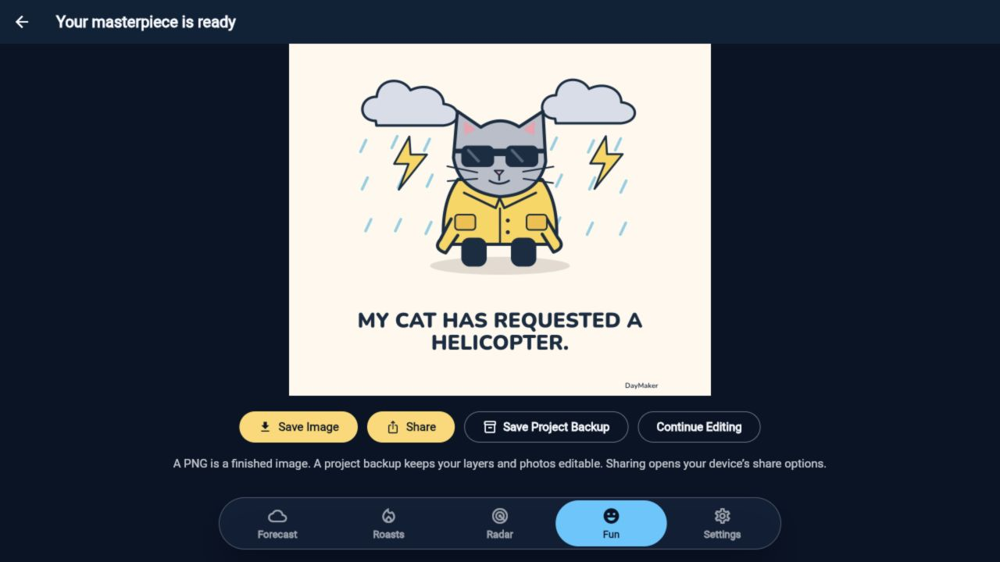

# Verification — 17 September 2026

## Delivery status

| Status | Evidence and limit |
| --- | --- |
| Code complete for the gated launch implementation | Weather/trust fixes, five logical native placements, separate fail-closed web adapter, persisted interstitial policy, UMP, reporting boundary, 50 bundled editorial lines, build guards and tests are implemented. |
| Native test ads verified | Android emulator and iPhone Air simulator loaded real official Google 320×50 and 300×250 test creatives with actual impression callbacks. Dedicated SDK fixtures reuse the application controller, adapters and display widget. |
| Native interstitial presentation verified | Both SDKs reported shown and impression events after explicit fixture Done. The iOS creative was visually inspected. Android's first-use immersive-mode notice obscured the creative. Native dismissal remains unverified. |
| Web adapter verified with simulated provider | Real Flutter platform-view DOM mounting, exact 300×250 bounds, one request across rebuilds, consent retirement and no-fill collapse were exercised. The provider was explicitly simulated; no live web ads were served. |
| Account configuration pending | Available AdMob browser session reached signup. No authorized app/unit console, approved web provider/CMP, store disclosures, seller IDs or developer domain were verified. |
| Live serving | **Not verified or activated.** Defaults disable ads. No deployment, store publication, production inventory activation, billing or signing changes were made. |

The original checkout and its untracked `.firebase/` state were preserved. Work is isolated on `feat/weather-first-ad-monetization`, based on current `origin/main` at `4f5632070a4ed785ba72cf72d29d0cb47fed982e`. A separate detached baseline checkout was used for comparison. Existing Firebase/GCP configuration remains `wingman-interactive-live` / `us-central1`.

## Automated and build results

Installed toolchain: Flutter 3.44.4, Dart 3.12.2, Xcode 26.3, Android SDK 36.1.0 and Java 21. Google Mobile Ads Flutter 9.1.0 was added without upgrading existing dependency versions; five new lockfile dependencies include its webview dependencies. Native SDK package resolutions are retained for reproducibility.

| Check | Baseline | Final |
| --- | --- | --- |
| Dart format | 190 files checked, no changes | Changed/new Dart files formatted; final check clean |
| Flutter analyze | Passed | Passed, no issues |
| Flutter unit/widget tests | 242 passed | 336 passed |
| Chromium browser tests | Existing browser cases included in final run | 8 passed: 4 existing Meme storage/export cases and 4 new web adapter boundaries |
| Web bridge Node tests | New suite | 6 passed |
| Native build validator Python tests | New suite | 3 passed |
| Functions build/tests | Existing plus added alert coverage checks | 16 passed |
| Android native Meme integration | Passed, original test unchanged | Passed; optional screenshot-channel limitation documented separately |
| Android debug build | Passed | Passed; real native SDK fixture builds also passed |
| Android release build | Not repeated for baseline | Passed, ads disabled; APK is a local build artifact, not a published store release |
| Web release build | Passed | Passed; Wasm dry run also succeeded, Wasm runtime was not separately tested |
| iOS simulator debug build | Passed | Passed, final `lib/main.dart` entrypoint |

The complete Flutter suite includes meaningful coverage for minimum actual content, filtered templates, personal drafts, same-route library/editor teardown, export-result/Done ordering, persistence, duplicate revision completions, first session and inactivity, rolling caps/restarts/clock changes, late loading, load/show failures, atomic reservations, consent revocation, route/modal races, foreground state, location changes, stale/unknown/active warnings, no-fill collapse and pointer safety. Loaded inventory and actual impressions are separate events; paid-event micros/currency/precision conversion is tested. Reporting remains no-op by default.

Weather regression tests prove old observations stay old despite fresh retrieval, future timestamps are not presented as current, offline caches retain their observation/retrieval times, Celsius values are converted rather than relabeled, missing precipitation remains unavailable, incomplete/gapped precipitation does not claim a complete next hour, and official alert metadata precedes comedy/ads. Request-count regressions cover ad loading/rebuild/teardown, controller startup/privacy/navigation and a fresh ad-like pause/resume without extra weather fetches or altered forecast values.

## Device, layout and interaction coverage

See [native SDK evidence](NATIVE_VERIFICATION.md) and [web adapter evidence](WEB_ADAPTER_VERIFICATION.md) for exact procedures, screenshots and limits.

| Surface/scenario | Executed evidence | Limit |
| --- | --- | --- |
| Android emulator | Real UMP, banner/MREC exact bounds and SDK impressions, route disposal, interstitial shown callbacks; native Meme edit/persist/reopen/render/export workflow | Not a physical Android device; native interstitial Close not operated |
| iPhone Air simulator, iOS 26.3 | Same real UMP/display checks; real interstitial creative; Meme editing/rendering reached add-to-Photos prompt | Photos permission and native ad Close could not be operated while desktop was locked |
| Native tablet/iPad | Responsive widget layouts compiled/tested | No real tablet SDK creative or iPad hardware run |
| Browser widths 320, 390, 430, 768, 1280 | Local release app navigated through Fun, library, editor and export; saved fixture survives navigation; Save Image reported download requested and explicit Done returned to Fun | Browser export result does not prove user accepted a downloaded file on disk |
| Fixed display sizes/large text | Widget geometry at all five widths with 2× text; 320×50/728×90 exact bounds, 300×250 MREC omitted below 300; navigation and action separation | Wide 728×90 native inventory is compile/widget verified, not device-loaded |
| Keyboard, modals, touch/scroll | Widget tests retire ads for keyboard insets and modal/route conflicts; failure removes label/creative immediately and defers height collapse while a pointer is held | Real mobile keyboard with provider inventory not exercised |
| Slow/offline/blocked inventory | Deferred loads, timeouts, late completions, script failure, offline weather, no-fill and revocation covered using controlled fakes | No real ad-blocking extension, network throttling or production inventory outage run |
| Consent | Real UMP update and `canRequestAds=true` in observed locale; required forms/privacy options/late callback/revocation logic tested with SDK channel fakes | Real EEA/UK consent choices and ATT changes not exercised; age classification remains unverified |
| Export isolation | Export preview contains no advertising widget; rendered document schema has no ad layer; original PNG layout/storage/browser tests and explicit Done transition tests pass | No personal user photos or private projects used for verification |

Native screenshots are clearly labeled test fixtures. They prove creative geometry, immediate “Advertisements” labeling, native test attribution and touch separation; they are not screenshots of every production screen. Screen-level placement rules are separately covered by widget tests. Current Roasts is a sample-only surface, so its MREC remains omitted. Test IDs do not guarantee production fill or motionless creatives.

## Known limitations and remaining activation work

- Native interstitial dismissal and post-dismissal warning/navigation need an unlocked device check. SDK callbacks for dismissal/failure/navigation are covered with injected tests; no native dismissal success is claimed.
- Android native Meme passed; iOS reached the real Photos permission dialog. A screenshot plugin failure is not a failed Photos save, and a permission prompt is not a completed save.
- The backend source now marks genuinely verified alert coverage, but it was not deployed. Current legacy responses without the marker remain unknown, deliberately preventing ad requests. Deployment requires separate authorization.
- Existing missing illustration assets produced browser 404 warnings and their existing fallbacks rendered. Kotlin plugin migration warnings, existing CocoaPods integration notices and missing iOS store version/build metadata remain visible in builds. No unrelated dependency, art, signing or store configuration rewrite was made.
- There is no authorized live web provider/CMP, verified native production app/unit inventory, audience declaration, finalized public legal policy/store disclosure set, or verified `app-ads.txt`/`ads.txt` domain mapping. See the exact [production checklist](PRODUCTION_CHECKLIST.md).
- The global/per-placement controls are local versioned configuration. No working remote kill endpoint or production analytics is claimed. D1/D7 retention, revenue/DAU, eCPM, p95 weather latency and radar response improvements cannot be inferred from development tests; consent-permitted measurement and a holdout launch comparison remain required.

## Reproduction

From this checkout:

```sh
flutter pub get
flutter analyze
flutter test
flutter test --platform chrome test/meme_platform_web_test.dart test/web_display_adapter_test.dart
node --test test/web/daymaker_ads_test.mjs
python3 -m unittest discover -s tools -p 'test_*.py'
flutter build apk --debug
flutter build apk --release
flutter build web --release
flutter build ios --simulator --debug
```

Run `npm test` from `functions/` for the backend checks. Native test commands and intentionally simulated web harness commands are documented in their linked evidence files. Do not publish an integration-test entrypoint. Local raw logs and the isolated baseline checkout are ignored under `work/verification/` and `work/baseline/`; screenshots and this report are tracked deliverables.

## Final checkpoint

The final `lib/main.dart` iOS simulator build passed. Android native Meme integration passed caption save, repository restart, imported-photo restart, four correctly sized PNG exports, backup import, and a real Photos save. Its optional integration-test screenshot channel is unavailable on this runner; only that `MissingPluginException` is recorded and tolerated. Product assertions remain strict, and a host-captured screenshot plus real PNG/backup files are retained. The iOS run was interrupted at the visible add-to-Photos permission dialog because native computer control was unavailable on the locked desktop.

The local release app was reopened at 1280×720 after rebuilding. The verification project remained in My Memes with its export record. Its export controls are visible and separated from bottom navigation, with no ads in the preview. One transient distorted capture after resizing was replaced by the verified fresh-render capture below; no product layout change was needed.



The unmodified baseline Android native Meme integration also passed, including its screenshot channel. The baseline source tree remained clean. The final test's screenshot-channel difference is recorded as a runner limitation with no asserted root cause; the final product's actual PNG, persistence, backup and Photos assertions passed. Both baseline and final Android flows completed in approximately 19 seconds after installation.
