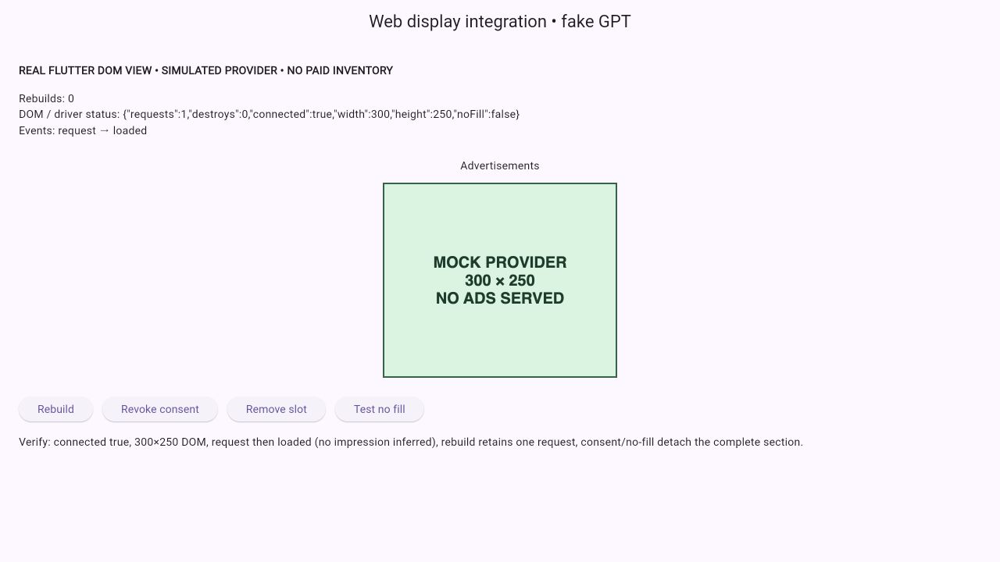
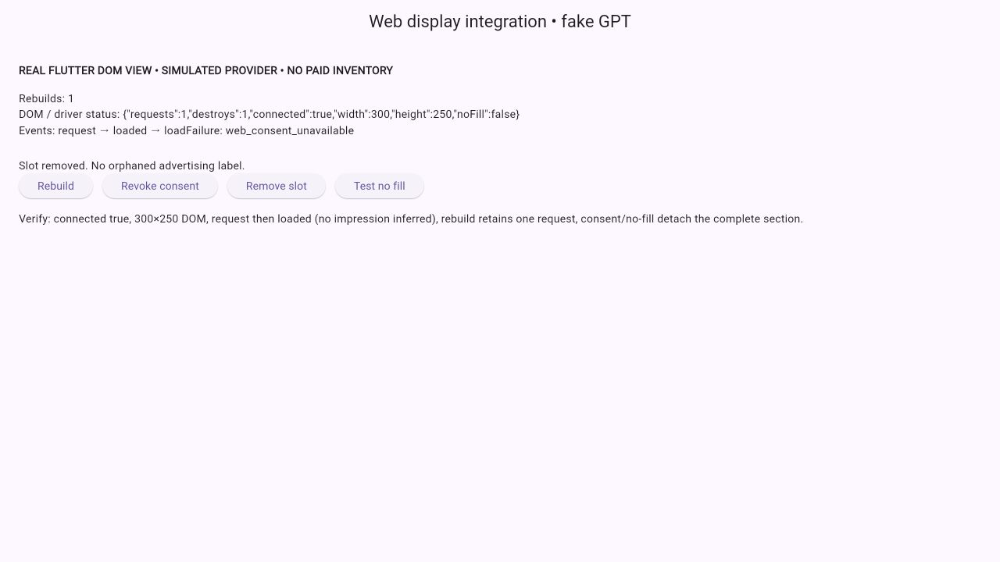
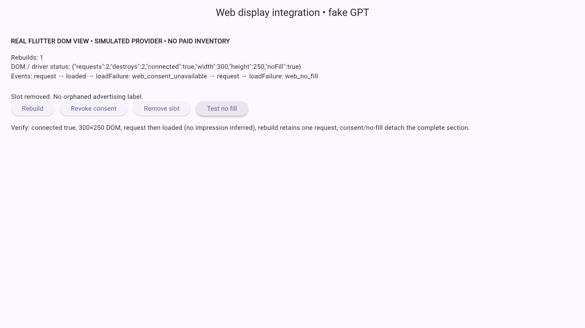

# Web display adapter and verification

Web serving remains unavailable at launch: an approved, app-specific GAM provider account and a verified certified CMP connection have not been established. The implemented adapter is separate from AdMob. No live ad unit, paid demand, provider approval, or live revenue is claimed.

## Implementation

`WebDisplayAdapter` is conditionally exported for browsers. Its native stub returns no inventory. An unconfigured `WebAdConsent` denies permission, and the additional `placementAllowed` callback also denies by default. The application must supply its current route, weather-safety, foreground, modal, and configuration eligibility through that callback. Consent and placement gates are rechecked after asynchronous GPT loading and immediately before the request.

`web/daymaker_ads.js` is a local bridge. Merely loading it does not contact Google. An eligible display handle creates a real `HtmlElementView` DOM element with exactly 320×50, 728×90, or 300×250 logical CSS pixels. The driver waits until that element is connected and visible, deduplicates the asynchronous GPT script, defines one fixed slot, and calls `display(element)` once. No manual refresh timer, hidden iframe, creative scaling/cropping, custom ad close button, or web interstitial is implemented.

A deferred handle is necessary because requesting before Flutter attaches the platform view would create an unattached slot. It reports no-fill, script errors/timeouts, consent revocation, or eligibility changes so `AdSection` can remove the complete section. The owning view destroys its GPT slot before removing the DOM element. Hidden/background slots are retired. Local script failures and unavailable consent leave weather and editing usable.

The adapter reports a request separately from `slotRenderEnded` (loaded/matched) and `impressionViewable` (a viewable impression, explicitly identified by `gpt_viewable_impression`). A loaded creative is never treated as an impression. This client does not estimate or emit web paid revenue; publisher reporting is required. Viewable-impression events are a subset of publisher impressions and should retain that distinction in analysis.

The implementation follows the official [GPT reference](https://developers.google.com/publisher-tag/reference), [event lifecycle](https://developers.google.com/publisher-tag/samples/ad-event-listeners), and [request control guidance](https://developers.google.com/publisher-tag/guides/control-ad-loading). Nonpersonalized requests are not a substitute for valid consent.

## Executed checks

- Six Node driver tests exercise actual DOM attachment/visibility gating with a simulated DOM, script deduplication, request versus render/viewability events, no-fill, script blocking, backgrounding, teardown, AdMob rejection, and eligibility changes during asynchronous loading and immediately before `display`.
- Four Chromium browser unit tests cover unconfigured CMP denial, native-unit/web-interstitial rejection, default-denied placement gates, no request before mounting, and revocation of a deferred handle.
- The real Flutter web app harness was opened and operated in the Codex in-app browser. It uses the production adapter and JavaScript bridge with a deliberately simulated GPT provider. Actual DOM geometry measured 300×250, `isConnected` was true, rebuilding preserved one request, revocation destroyed the slot and removed its label, and no-fill collapsed the entire section. Browser warning/error logs were empty during these checks.

The actual-renderer harness is separate from automated widget tests, whose mocked HTML-platform-view registry does not prove real DOM composition. Run it as an app:

```sh
flutter run -d web-server --web-hostname 127.0.0.1 --web-port 8768 -t integration_test/web_ad_harness.dart
node --test test/web/daymaker_ads_test.mjs
flutter test --platform chrome test/web_display_adapter_test.dart
```

The harness explicitly displays `MOCK PROVIDER / NO ADS SERVED`. It never installs a real Google tag, uses paid demand, or manufactures ad clicks. It is not the application entry point and must not be published as the production app.







## Still required before activation

An authorized GAM configuration, actual paid demand, site approval where required, certified CMP integration and consent-signal verification, accurate audience declarations, correct seller records/domain disclosures, and real provider inventory testing remain external readiness requirements. Approved web inventory and consent must be tested with the production renderer, responsive layouts, privacy choices, and real ad blocking before turning on web serving. Web interstitials and adjacent advertising humor remain disabled. AdSense approval and AdMob approval are separate; this change does not implement or claim a live AdSense placement.
